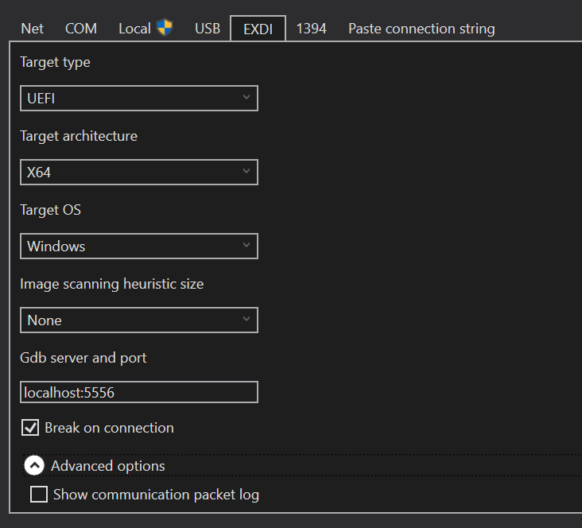

# UEFI Debugging

This guide covers interactive UEFI debugging using the MU Feature Debugger with WinDbg.

## Overview

MsvmPkg uses the MU Feature Debugger for interactive UEFI debugging. Full documentation can be found [here](https://github.com/microsoft/mu_feature_debugger/blob/HEAD/DebuggerFeaturePkg/Readme.md?plain=1).

## Prerequisites

- **WinDbg:** Must be installed on your system. Documentation available [here](https://learn.microsoft.com/en-us/windows-hardware/drivers/debugger/)
- **Debug-enabled firmware:** Build with `BLD_*_DEBUGGER_ENABLED=1` (see [BUILDING.md](BUILDING.md#debug-enabled-build))

## Shared Setup

These steps apply to all platforms:

### Installing the UEFI Extension

The `uefiext.dll` extension is required for loading UEFI symbols and modules.

1. **Download the extension** from the [MU Feature Debugger pipeline artifacts](https://github.com/microsoft/mu_feature_debugger/actions/workflows/Build-UefiExt.yaml)

2. **Install the extension** by placing the DLL where WinDbg can access it:
   ```
   C:\Users\<user>\AppData\Local\dbg\EngineExtensions\uefiext.dll
   ```

### Common Debugging Workflow

Once WinDBG is connected (see platform-specific sections below):

1. **Configure symbol paths** (if building on a different machine):
   ```
   .sympath+ {root}\Build\Msvm{architecture}\{flavor}_{toolchain}\PDB
   ```

2. **Initialize the UEFI extension**:
   ```
   !uefiext.init
   ```

3. **Load modules and start debugging**:
   - Use `!uefiext.findmodule` and `!uefiext.findall` to resolve loaded binaries
   - Use WinDbg UI buttons or commands to step, break, continue, etc.

## Platform-Specific Setup

### Hyper-V Debugging

Hyper-V requires a more complex setup using named pipes and TCP bridging.

#### Additional Prerequisites

1. **Python with required packages:**
   ```cmd
   pip install pyserial
   pip install pywin32
   ```

2. **ComToTcpServer.py script** from the MU Feature Debugger repository

**Windows Server Note:** If you encounter "This installation is Forbidden by System Policy" when installing Python, run this PowerShell script as Administrator:

```powershell
# Modify the system registry to allow MSI installations
$registryPath = "HKLM:\SOFTWARE\Policies\Microsoft\Windows"
$registryKey = "Installer"
$registryValueName = "DisableMSI"
$registryValue = 0

# Create the registry key if it doesn't exist
if (-not (Test-Path "$registryPath\$registryKey")) {
    New-Item -Path $registryPath -Name $registryKey -Force
}

# Set the registry value
Set-ItemProperty -Path "$registryPath\$registryKey" -Name $registryValueName -Value $registryValue
```

#### Connection Steps

1. **Configure VM serial port** for COM1 communication:
   ```powershell
   Set-VMComPort -VmName "myvm" -Number 1 -Path \\.\pipe\port1 -DebuggerMode On
   ```

2. **Start the COM-to-TCP bridge**:
   ```cmd
   py ComToTcpServer.py -v -n \\.\pipe\port1 -p 5556
   ```
   (The `-v` flag provides verbose output to verify the connection)

3. **Start your VM**. It will appear to hang with a black screen because the debugger is waiting for connection.

4. **Launch WinDbg** and configure the EXDI connection:
   - Press `Ctrl-K` to open Kernel Debugger options
   - Click the **EXDI** tab
   - Configure settings for your platform:
     > 
   - **Note:** You do not need to set "break on connection"

5. **Follow the common debugging workflow** above

### OpenVMM Debugging

OpenVMM debugging is simpler as it provides direct TCP connectivity.

**Key Advantage:** Since OpenVMM typically runs in WSL, you can connect to WinDbg through a TCP connection from WSL, as network traffic passes through to the Windows host.

#### Connection Steps

1. **Launch OpenVMM with TCP serial support** through WSL:
   ```bash
   cargo run -- --uefi --uefi-firmware /mnt/d/{root}/Build/Msvm{architecture}/{flavor}_{toolchain}/FV/MSVM.fd --com1 listen=tcp:127.0.0.1:5556
   ```

2. **Launch WinDbg** and configure the EXDI connection:
   - Press `Ctrl-K` to open Kernel Debugger options
   - Click the **EXDI** tab
   - Configure settings for your platform (same as Hyper-V example above)

3. **Follow the common debugging workflow** above

### OpenHCL Debugging

OpenHCL debugging follows the same pattern as OpenVMM, but uses the IGVM image built for OpenHCL.

1. **Use your OpenHCL IGVM image** (see [FIRMWARE-DEPLOYMENT.md](FIRMWARE-DEPLOYMENT.md#openhcl-deployment))

2. **Launch with TCP serial support** (specific commands depend on your OpenHCL setup)

3. **Connect WinDbg** using the same EXDI configuration as OpenVMM

## Troubleshooting

### "Failed to connect to target"
- **Hyper-V:** Verify the COM-to-TCP bridge is running and connected to the named pipe
- **OpenVMM:** Check that the TCP port (5556) is not in use by another process
- **All platforms:** Ensure the VM is actually waiting for debugger connection

### "No symbols found"
- Verify the symbol path points to the correct PDB directory
- Ensure you built with debug symbols enabled
- Check that the PDB files match the firmware image version

### "UEFI extension commands not working"
- Verify `uefiext.dll` is in the correct WinDbg extensions directory
- Run `!uefiext.init` before using other UEFI commands

### VM appears completely frozen
- This is normal behavior when the debugger is waiting for connection
- The VM will resume normal operation once WinDbg connects
- If still frozen after connection, try pressing 'g' (go) in WinDbg

## Advanced Debugging

For comprehensive debugging configurations and connection scenarios, refer to the [official MU Feature Debugger documentation](https://github.com/microsoft/mu_feature_debugger/blob/HEAD/DebuggerFeaturePkg/Readme.md).

## Next Steps

- **Collect logs alongside debugging:** See [LOGGING.md](LOGGING.md)
- **Explore advanced VM features:** See [ADVANCED.md](ADVANCED.md)
